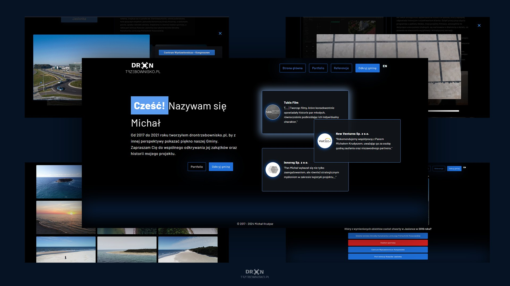

# DronTrzebownisko.pl interactive portfolio

## Brief Description

An interactive React application presenting the history of my activities through dynamic references on the homepage, personalized modals, and galleries of photos and videos. It features a location filter allowing users to browse photos from specific areas and an interactive quiz for residents. The application is characterized by dynamic content loading, including descriptions and English translations, from external data files, ensuring flexibility in content management and easy information updates.

## Technologies

- React
- React Router
- React Ref
- Suspense
- React LazyLoad
- Context API
- SCSS

## Features

- **Dynamically changing references on the homepages**: The application displays different random references on the homepage every three seconds, which can be clicked to view in their own personalized reference modal.
- **Language switching capability**: By clicking the language icon, using the Context API, the language on the page is changed, and this setting is remembered in the browser's memory.
- **Custom video players**: Personalized video players that allow stopping, resuming, clicking on the timeline to rewind, buttons to skip forward or backward, and a progress bar indicating the current position.
- **Filtering option**: Filtering option that allows selecting locations of interest, so only photos from that location are displayed.
- **Interactive quiz**: An interactive quiz that shows a place and a related question with four answers. It counts down the time to answer and indicates whether the selected answer was correct or incorrect by color. At the end, answers are tallied, and a summary is provided.
- **Animated loading page**: A page that has an animated drone with spinning propellers, waiting for the content to load.

## App Screenshots

### Website mockup

#### The presentation of the website's functionality is available below in the form of GIFs, which may take a moment to load.

### Homepage

### Portfolio page

### Content filtering and municipality tour page

### Quiz page

### References page

## Pre-installation Requirements

A Node.js environment is required to run the application locally. To set up the project:

1. Clone the project repository.
2. Navigate to the project directory and run `npm install` to install dependencies.
3. Open a terminal window and execute `npm run dev` to start the frontend application in development mode
